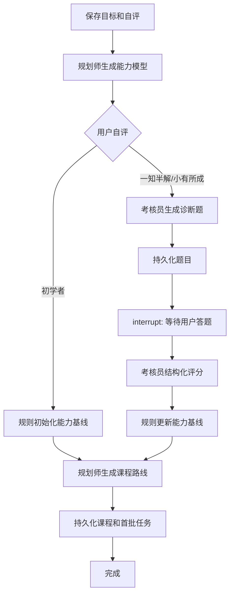

# Growth Loop V1 实施方案

## 1. V1 要验证的闭环

V1 不追求“Agent 数量”，只验证系统能否根据用户真实水平持续安排下一步：

```text
创建目标 → 自评层级 → 可选诊断 → 能力基线 → 课程路线
→ 每日课程任务 → 课后考核 → 更新掌握度 → 调整后续任务
```

创建目标时增加三档自评：

| 页面文案 | 数据值 | 初始处理 |
|---|---|---|
| 初学者 | `beginner` | 跳过诊断，`confidence = 0` 表示暂无证据，课程从基础概念开始；第一次课后小测直接形成首个掌握度估计 |
| 一知半解 | `familiar` | 生成约 5 道诊断题，概念与解释题为主，包含少量应用题 |
| 小有所成 | `intermediate` | 生成约 8 道诊断题，以应用、调试和设计题为主 |

自评只决定诊断入口，不直接作为能力分数。最终基线由诊断结果决定。

## 2. LLM 生成题库的边界

题目可以由 LLM 生成，但不能每次打开页面临时生成、答题时再次生成。正确流程是：

1. 规划师先把目标拆成 `goal_skills`。
2. 出题 Agent 根据能力、目标层级、难度和题型生成结构化题目。
3. 服务端进行数量、字段、难度分布、重复度和能力覆盖校验。
4. 将题目、参考答案和评分 rubric 固化到 `diagnostic_questions`。
5. 用户提交答案后，考核 Agent 只能读取这份固定快照进行评分。
6. 每次答案和评分结果写入 `diagnostic_attempts`，不能覆盖历史尝试。

建议的结构化输出：

```python
class DiagnosticQuestion(BaseModel):
    skill_key: str
    kind: Literal["concept", "explanation", "application", "debugging", "design"]
    difficulty: int = Field(ge=1, le=5)
    prompt: str
    hint: str
    reference_answer: str
    rubric: list[RubricItem]
    max_score: int = Field(gt=0)

class DiagnosticSet(BaseModel):
    questions: list[DiagnosticQuestion]
    coverage_notes: list[str]
```

LLM 题库适合个性化诊断，但它不是天然可靠的知识库。后续面试系统应为题目增加来源字段，并优先使用官方文档、可信题库或 RAG 材料生成和校验；没有可靠来源时，题目应明确标记为 `llm`。

## 3. LangGraph 与 Pydantic AI 的分工

不要同时使用 LangGraph 和 Pydantic Graph。V1 采用以下单一职责：

- LangGraph：共享状态、条件分支、循环、等待用户答题、断点恢复。
- Pydantic AI Agent：在指定节点中调用模型，并用 `output_type` 返回经过校验的 Pydantic 模型。
- 普通 Python 函数：图内路由、分支条件、重试选择等不依赖数据库事务的确定性计算。
- **分数归一化、掌握度、合格阈值和完成门禁由 Next.js 普通函数在写事务内执行**；Python 节点只提交结构化模型证据，见 §4。

目标创建图：



建议的图状态只保存 ID 和小型 JSON，不在 checkpoint 中复制完整课程正文：

```python
class GoalOnboardingState(TypedDict):
    workflow_run_id: str
    user_id: str
    goal_id: str
    self_level: Literal["beginner", "familiar", "intermediate"]
    diagnostic_assessment_id: str | None
    diagnostic_attempt_id: str | None
    program_id: str | None
    error_code: str | None
```

Pydantic AI 节点输出：

| 节点 | Agent | `output_type` |
|---|---|---|
| `build_skill_map` | PlannerAgent | `SkillMapOutput` |
| `generate_diagnostic` | ExaminerAgent | `DiagnosticSet` |
| `grade_diagnostic` | ExaminerAgent | `DiagnosticGrade` |
| `generate_program` | PlannerAgent | `LearningProgramOutput` |
| `generate_lesson_content` | TutorAgent | `LessonContentOutput` |
| `generate_lesson_check` | TutorAgent | `LessonCheckSetOutput` |
| `grade_lesson_check` | TutorAgent | `LessonCheckGradeOutput` |
| `daily_review` | ReviewerAgent | `DailyReviewOutput` |

数据库写入不作为 Agent 工具开放。节点拿到结构化输出后，交由 Next.js 的内部接口验证用户归属、状态和幂等键，再执行事务。图状态只持有返回的 ID——这正是上面 `GoalOnboardingState` 只放 ID 不放正文的原因。

## 4. 服务边界

Pydantic AI 和 LangGraph 都运行在 Python 侧；**Next.js 是数据库的唯一写入方**：

```text
Next.js
├── 页面、登录、会话
├── SQLite 业务数据的唯一写入方
├── /api/goals、/api/tasks 等对外接口
├── /api/internal/* 供 Python 回调的落库接口（内部服务密钥）
└── 调用 Python workflow service

Python FastAPI
├── LangGraph 工作流（状态、分支、interrupt、checkpoint）
├── Pydantic AI Agents（节点内调用模型，output_type 校验）
├── 图内确定性路由（分支、重试选择）
├── /workflows/goal-onboarding/start
├── /workflows/{run_id}/resume
└── /workflows/{run_id}
```

### 为什么落库留在 Next.js

这是 2026-08-27 定下的边界，两个方案在图的形状、节点划分、Agent 定义和 interrupt 位置上完全相同，差别只在每个节点里落库那一行是发内部 HTTP 还是直接执行 SQL。选择前者的理由：

1. `lib/db/` 已经承载了事务、归属校验和 V0.4.1 建立的快照边界，用 Python 重写一遍等于维护两份 schema 认知，漂移是迟早的事。
2. 登录会话必须留在 Next.js（Cookie 与中间件要读写 `sessions`）。若 Python 也写库，就是两个进程写同一个 SQLite，写锁和双份维护都要管。
3. 图状态本来就只持有 ID，说明行由别处写入、图只记住它在哪——与该边界天然一致。

代价是节点内多一次网络往返，且单个节点无法把多次落库调用包进同一个事务。后者由图的断点恢复兜底，不依赖数据库事务。

本地开发可继续使用 SQLite；LangGraph checkpoint 应使用持久化 checkpointer，并通过 `thread_id` 与 `workflow_runs.thread_id` 对应。生产环境再把业务数据库和 checkpoint 迁到 PostgreSQL。

## 5. 数据库 V2

`DATABASE_SCHEMA_VERSION = 2` 新增：

| 数据域 | 表 |
|---|---|
| 目标自评 | `goal_learning_profiles` |
| 能力模型 | `goal_skills`、`skill_mastery` |
| 课程 | `learning_programs`、`course_modules`、`course_lessons` |
| 任务课程关系 | `task_lesson_links` |
| 初始诊断 | `diagnostic_assessments`、`diagnostic_questions`、`diagnostic_attempts` |
| 课后考核 | `lesson_assessment_attempts` |
| 工作流与成本 | `workflow_runs`、`agent_runs` |

课程正文和题目中的变长结构暂存为 JSON 文本；需要查询和统计的状态、分数、能力、顺序和关联全部使用普通字段。

`DATABASE_SCHEMA_VERSION = 3` 在此基础上给 `goals` 增加了可计算的 `target_date`，并引入 `COLUMN_ADDITIONS` 幂等加列机制——`CREATE TABLE IF NOT EXISTS` 对已存在的表会整条跳过，加新列必须同时写进建表语句和加列数组。详见[开发者手册 §3.4](DEVELOPER_HANDBOOK.md)。

执行以下命令可在内存 SQLite 中完整创建并校验 schema：

```powershell
npm.cmd run db:validate
```

## 6. 实施顺序

### V0.4.1：数据持久化

- 为目标创建接口加入 `selfLevel`、`weeklyHours` 和 `background`。
- 把当前 localStorage 课程写入 V2 课程表。
- 课程任务通过 `task_lesson_links` 关联，不再按标题匹配。
- 课后评分写入 `lesson_assessment_attempts`。

### V0.4.2：最小学习闭环

完整设计见 [V0.4.2 实施方案](IMPLEMENTATION_PLAN_V042.md)，Agent 角色与信息边界见 [Agent 角色与信息边界](AGENT_ROLES.md)。要点：

- 按角色重组 Agent 层：规划员、导师、考官各自拥有稳定的信息边界和公共 policy；导师负责课程讲解与形成性小测，考官负责初始诊断和后续阶段大考/模拟面试。
- **初始诊断前置**：创建目标时必选三档基础，先拆能力；`familiar`、`intermediate` 完成诊断后才允许生成课程，`beginner` 跳过时保持“未知基线”而不是伪造零分。
- **课程改为骨架先行、章节按需生成**，删除 `genericLessons` / `agentLessons` 正常模板路径；先生成第一节，课后证据确定难度后再生成下一节。
- **两类考核分开**：导师根据本节实际教学和学习者卡点生成巩固题、评分与补充讲解；考官不参与课程小测，只按目标能力标准执行初始诊断、大考与面试。
- 闭环回边：导师形成性证据 → Next.js 事务更新 `skill_mastery` / 章节 / 关联任务 → LearningPolicy 决定难度 → 导师生成下一节；导师成绩不能直接充当毕业证明。
- 本轮不引入 LangGraph：诊断等待先由数据库状态和幂等 API 实现，V0.4.3 再迁移为 `interrupt` 与 checkpoint。

创建目标时勾选能力模块、可行性审查确认仍排到 V0.4.3；初始诊断属于课程个性化的前置证据，已经进入 V0.4.2。V0.4.2 只固化业务状态与接口，V0.4.3 接管编排，不重复定义诊断规则。

规划师可行性审查的字段归属：

| 字段 | 来源 |
|---|---|
| `availableHours` | **普通函数计算**：剩余周数 × 每周投入，见 `lib/goal-schedule.ts` |
| `estimatedHours` | 按 `goal_skills` 逐项估时求和，**普通函数** |
| `verdict` | `feasible` / `tight` / `unrealistic`，由两个工时的比值按阈值判定，**普通函数** |
| `reason`、`adjustments[]` | 模型输出 |

**为什么审查排在能力拆解之后**：审查的核心是 `estimatedHours`。在 `goal_skills` 存在之前，模型只能从目标标题猜一个数，既不可解释也无法追问；先拆解、再逐项估时，用户才能看到「哪一项占了 40 小时」并据此调整。同样的拆解结果也是课程个性化和后期进度监督的依据，所以它是三者共同的地基。

### V0.4.3：Python 工作流服务

- 建立 FastAPI、LangGraph 和 Pydantic AI 基础工程。
- 先实现 `goal_onboarding` 一张图，并把 V0.4.2 已有的诊断暂停状态接成 `interrupt`。
- 接入持久化 checkpointer、幂等键、超时、重试和 `agent_runs` Token 记录。
- Next.js 通过内部服务密钥调用，不向浏览器暴露 Python 服务。

### V0.5：自适应循环

- 不合格进入补充讲解和重测分支。
- 在 V0.4.2 原子更新能力掌握度和任务的基础上，增加补课、重测和间隔复测循环。
- 根据长期薄弱能力重排后续骨架或增加复测任务。
- 增加考官负责的阶段大考、模拟面试和毕业门禁，并把总结性证据与导师形成性小测分开统计。

## 7. 当前边界

本次已完成数据库 V2 schema 和校验脚本，尚未修改创建目标 API、页面自评控件，也尚未引入 Python/LangGraph/Pydantic AI 依赖。先稳定数据契约，再接工作流，可以避免 UI、Node API 和 Python 状态各存一份互相冲突的数据。

参考：

- [LangGraph Graph API](https://docs.langchain.com/oss/python/langgraph/graph-api)
- [LangGraph Persistence](https://docs.langchain.com/oss/python/langgraph/persistence)
- [LangGraph Interrupts](https://docs.langchain.com/oss/python/langgraph/interrupts)
- [Pydantic AI Structured Output](https://pydantic.dev/docs/ai/core-concepts/output/)
