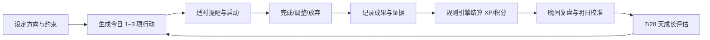
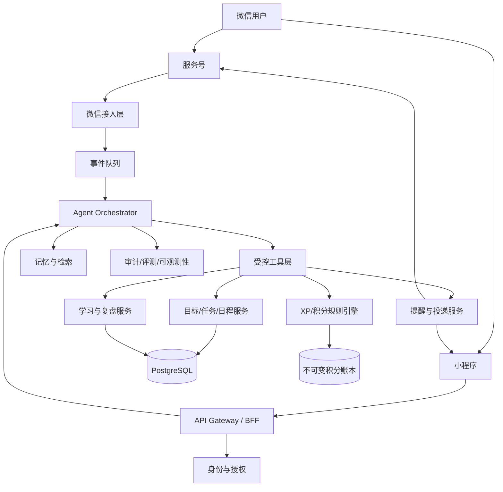

# 「成长回路」完整产品设计方案 v0.1

> 文档状态：产品基线草案  
> 日期：2026-08-09  
> 面向阶段：概念验证 → MVP → 微信正式接入  
> 工作名：成长回路（后续可更名）

## 1. 产品定义

### 1.1 一句话定位

成长回路是一个生活在微信里的自我提升 Agent：它帮助用户把目标拆成今天能完成的行动，低摩擦记录日程、学习和待办，用可追溯证据评估进步，再通过经验值、积分和温和的连续机制让行动更容易坚持。

### 1.2 核心价值

用户真正缺少的通常不是计划工具，而是四件事之间的闭环：

1. 知道现在最值得做什么；
2. 在真实生活中被适时提醒并开始行动；
3. 完成后用很小成本留下可信记录；
4. 看见长期变化，而不只是看到打勾数量。

产品承诺不是“保证用户成功”，而是让用户每天更容易完成一个有意义的成长动作，并逐渐获得对自身节奏的真实认识。

### 1.3 产品原则

- 行动优先：每次对话尽量收敛到一个明确的下一步。
- 低负担：一次日常记录最好在 30 秒内完成。
- 证据优先：事实、用户自评和 Agent 推断严格分开。
- 温和督促：提醒可以坚定，但不羞辱、不制造亏欠感。
- 游戏化服务于成长：不为签到而签到，不奖励无意义任务膨胀。
- 用户掌控：提醒时间、强度、数据保留和奖励规则可配置、可暂停。
- 规则可解释：经验值、积分和成长评分都能回答“为什么”。

## 2. 目标用户与场景

### 2.1 首批目标用户

MVP 聚焦 18 岁以上、已经有明确提升意愿但执行不稳定的个人用户，优先覆盖：

- 学习型用户：备考、语言、阅读、专业技能；
- 知识工作者：需要管理学习、项目推进和个人复盘；
- 初入职场者：需要培养持续学习、任务拆解和时间管理习惯。

暂不针对重度临床心理健康干预、儿童监督、企业绩效考核或公开排名竞争场景。

### 2.2 核心 Job to Be Done

- 当我一天很忙时，帮我选出今天真正重要的 1–3 件事。
- 当我拖延时，用不过度打扰的方式让我迈出第一步。
- 当我完成学习或任务时，快速帮我记下来并整理成积累。
- 当我觉得自己没有进步时，用近 7/28 天证据告诉我哪里变好了、哪里只是感觉。
- 当计划持续失败时，帮我缩小任务或调整节奏，而不是继续堆提醒。

### 2.3 非目标用户行为

- 通过批量创建和完成碎片任务刷经验；
- 用积分评价人的价值；
- 用连续天数制造焦虑或惩罚中断；
- 让 Agent 擅自修改现实日历、向他人发送消息或进行消费。

## 3. 核心产品闭环

### 3.1 每日节奏

**晨间规划（30–90 秒）**

- Agent 汇总日程、逾期待办、当前目标和可用时间；
- 推荐“1 个主任务 + 最多 2 个次任务”；
- 用户可回复“确认”“改成晚上”“今天只做 10 分钟”。

**白天执行**

- 仅在用户授权的时间窗提醒；
- 用户可用自然语言输入：“背了 25 分钟单词，复习 80 个，错 12 个”；
- Agent 解析为学习记录，向用户展示结构化确认，而不是静默写入不确定字段。

**晚间复盘（60 秒）**

- 今天完成了什么？
- 哪个行动产生了实际进展？
- 明天应继续、缩小还是暂停什么？
- 完成后给出结算和一句基于事实的反馈。

### 3.2 每周节奏

- 展示有效成长时段、任务兑现率、计划偏差、重点技能投入和能量自评；
- 只比较用户自己的近 7 天与此前 28 天基线；
- 给出一项保持、一项调整和一个下周实验；
- 用户确认后才修改长期计划。

## 4. 信息架构与主要界面

### 4.1 微信服务号对话入口

适合：快速记录、询问今天做什么、完成反馈、轻量复盘。

典型消息：

- “今天要做什么？”
- “把周三晚上的英语挪到周四。”
- “刚看完第三章，做了 12 道题，错 3 道。”
- “这周我有进步吗？”
- “暂停提醒三天。”

菜单建议：`今日行动`、`快速记录`、`成长报告`，点击后进入对应小程序页或触发对话。

### 4.2 微信小程序工作台

五个一级页面：

1. **今日**：时间轴、主任务、快速开始、完成/延后/缩小；
2. **计划**：目标、项目、日程、待办及重复规则；
3. **记录**：学习日志、成果证据、反思和检索；
4. **成长**：等级、XP、技能树、7/28 天趋势、周报；
5. **我的**：提醒、隐私、积分奖励、导出和删除数据。

### 4.3 管理后台

MVP 仅提供必要运营能力：用户状态、消息投递状态、模板配置、模型/工具错误、申诉与数据删除工单。后台不得默认展示用户原始私密日记；需要排障时采用授权、脱敏和审计日志。

## 5. 功能设计

### 5.1 新用户引导

首次使用控制在 3 分钟内：

1. 选择当前最想提升的方向；
2. 写出一个 4 周目标或让 Agent 协助形成草案；
3. 选择每天可投入的时间和不可打扰时段；
4. 设定督促风格：温和、直接、教练式；
5. 创建第一个最小行动；
6. 解释 XP 与积分分账，主动请求必要的消息授权。

Agent 不要求用户一开始就建立完整人生规划。资料不足时，从 7 天试运行开始。

### 5.2 目标与计划

目标结构：`方向 → 4–12 周目标 → 里程碑 → 可执行任务 → 行动记录`。

每个目标至少包含：想达到的结果、原因、衡量方式、截止或复审日期、每周可投入时间。Agent 生成的目标必须经过用户确认。

### 5.3 日程与待办

- 日程强调“何时发生”，待办强调“需要完成”；
- 支持自然语言创建、修改、完成、取消和重复；
- 冲突时先提示，不自动覆盖；
- 每日主任务最多 1 个，推荐总任务不超过 3 个；
- 任务连续两次延后时，自动触发“缩小、改时、删除、重新定义”四选一诊断。

### 5.4 学习记录

支持文本、语音转写、图片/OCR 后的结构化记录。字段包括：主题、时长、材料、练习量、正确率、关键理解、疑问、下一步和可选证据。

系统区分：

- 投入证据：学习时长、阅读页数；
- 产出证据：习题、笔记、作品、测验；
- 掌握证据：延迟回忆、重复测试、实际应用；
- 用户自评：难度、专注、信心；
- Agent 推断：主题分类、能力映射、质量建议。

### 5.5 待办完成确认

低风险日常任务可一键完成；高 XP 或里程碑任务要求至少一句成果说明。Agent 可发现异常，但不对用户进行“测谎”。疑似刷分时降低可计分上限并提示规则，不做道德评价。

### 5.6 复盘与进步评估

进步评估包含五个维度：

| 维度 | 含义 | 主要证据 |
|---|---|---|
| 持续性 | 是否形成可维持节奏 | 有效行动日、间隔分布 |
| 执行力 | 计划是否兑现 | 主任务兑现率、延期率 |
| 学习深度 | 是否从输入走向掌握 | 练习、回忆、测验、作品 |
| 反思校准 | 是否依据反馈调整 | 复盘、计划修正、预测误差 |
| 可持续性 | 强度是否适合现实状态 | 能量自评、超负荷和中断模式 |

每个结论必须包含时间窗、证据数量、置信度和建议。例如：

> 近 7 天完成了 4 次英语行动，比此前 28 天周均 2.1 次更稳定；但目前主要是输入记录，尚缺少延迟回忆证据。结论置信度：中。

系统不使用单一总分宣称用户“成长了 23%”。总览分只用于趋势导航，点击必须能看到分项和原始依据。

## 6. 游戏化经济系统

### 6.1 双账本

- **经验值 XP**：长期累计，只增不减，表达用户投入和达成的成长轨迹，不可消费。
- **成长积分 Coin**：用于兑换用户自己设定的奖励，可获得、消费、撤销和审计。

等级是展示，不解锁核心生产力功能，避免把必要能力锁在游戏进度后。

### 6.2 XP 结算

基础 XP 按行动规模结算：

| 行动 | 基础 XP |
|---|---:|
| 5–15 分钟最小行动 | 5 |
| 16–45 分钟专注行动 | 10 |
| 46–90 分钟深度行动 | 20 |
| 经确认的阶段成果 | 30–50 |

结算公式：

`XP = 基础值 × 质量系数 × 证据系数 × 连续系数`

- 质量系数：0.8–1.3，依据练习/产出/复盘深度，不由语言华丽程度决定；
- 证据系数：0.8–1.2，无证据也可记录，但高价值成果需要可核验说明；
- 连续系数：1.0–1.15，只提供小幅加成，避免中断后放弃；
- 普通行动每日计分上限建议 100 XP，里程碑单独审核；
- 系数和原因必须展示，规则引擎计算，LLM 只能给结构化建议。

等级建议采用递增阈值：`升级累计 XP = 100 × 等级^1.5`。等级只用于长期反馈，不用于用户间排行榜。

### 6.3 积分结算与兑换

- 默认 `Coin = 最终 XP × 0.4`，向下取整；
- 用户可建立现实奖励，如“80 分看一部电影”“200 分买一本书”；
- 兑换必须由用户主动确认；
- 不引导用户把食物、睡眠、医疗、休息等基本需要设为必须赚取的奖励；
- 账本使用不可变交易记录，修正通过冲正交易完成，禁止直接改余额。

### 6.4 连续机制

- “有效行动日”只要求完成一个与目标相关的最小行动；
- 每 7 天获得 1 次缓冲，可保护一次非计划中断；
- 中断不会扣 XP，只提示重新开始；
- 支持病假、旅行和主动休整模式；
- 文案不用“失败、掉队、你又没坚持”。

### 6.5 防刷与负激励保护

- 同类超小任务合并计分；
- 重复任务在达到每日阈值后仍可记录但不再增加 XP；
- Agent 生成任务不直接产分，只有用户行动产分；
- 删除任务不扣分，撤销错误完成记录时用冲正交易；
- 不提供全站排行榜；未来若有社交，仅比较团队共同目标，不排名人格或努力。

## 7. Agent 设计

### 7.1 角色

Agent 是“行动教练 + 记录员 + 复盘助手”，不是权威导师、心理治疗师或价值裁判。

### 7.2 行为状态机

`理解意图 → 获取必要上下文 → 提议结构化变更 → 用户确认（需要时）→ 调用工具 → 返回结果与下一步`

高置信度低风险操作（如完成一个已明确指认的待办）可直接执行并允许撤销；以下操作必须确认：批量删除、修改长期目标、改变提醒强度、兑换积分、覆盖日程、导出/删除账户数据。

### 7.3 工具边界

Agent 通过受控工具读写：

- `get_today_context`
- `create_or_update_task`
- `log_learning_session`
- `complete_task`
- `schedule_reminder`
- `generate_review`
- `propose_xp_award`
- `post_ledger_transaction`
- `pause_coaching`
- `export_or_delete_data`

LLM 不直接写数据库、不直接计算余额、不自行发送未经授权的主动消息。所有写操作带幂等键、用户 ID、来源事件 ID 和审计记录。

### 7.4 记忆层级

- 会话记忆：当前对话和未完成确认，短期有效；
- 工作记忆：今日计划、最近记录、当前提醒；
- 长期偏好：督促风格、时间窗、目标、禁忌和常用习惯；
- 成长事实：经用户确认的成果与评估；
- 原始内容：按最短必要期限保存，可由用户删除。

Agent 不能把一次情绪表达永久固化为人格标签。长期偏好变更要可见、可编辑。

### 7.5 回答风格

- 先承认现实约束，再给一个可做的动作；
- 默认回答控制在微信一屏内；
- 任务失败先诊断规模、时间和阻力，不进行意志评价；
- 每次最多一个主要建议；
- 成长评价必须引用具体记录，不生成空泛鼓励。

### 7.6 安全升级

若用户表达自伤、自杀或现实危险，Agent 暂停游戏化与任务督促，转为支持性、安全导向回应，鼓励联系当地紧急服务和可信任的人。不得用 XP 激励健康、用药或危机行为。医疗、法律和财务建议只提供一般信息并提示专业支持。

## 8. 微信接入设计

### 8.1 推荐组合

**C 端 MVP：已认证微信服务号 + 微信小程序 + 自有后端。**

- 服务号承载自然语言消息、菜单和轻量反馈；
- 小程序承载日历、待办、记录编辑、报告、授权和设置；
- 服务端统一身份、Agent、规则引擎和数据账本；
- 微信开放平台 UnionID 仅在满足绑定条件时用于跨应用身份合并，不能假定天然可用。

### 8.2 为什么不只做聊天机器人

聊天适合输入，结构化界面适合浏览、修改和理解复杂状态。若只用服务号对话，用户难以查看一周日程、积分流水和报告证据；若只用小程序，记录摩擦和日常触达又偏高。因此采用混合形态。

### 8.3 消息链路

服务号收到用户消息后，微信服务器会把事件推送到开发者 URL。官方文档要求被动响应在 5 秒内完成，否则可能重试。推荐链路：

1. 验证签名并解密；
2. 用消息 ID 或事件组合键去重；
3. 立即返回 `success` 或轻量被动回复；
4. 异步执行 Agent 推理；
5. 在微信允许的能力与用户授权范围内返回结果，或引导打开小程序查看。

严禁把耗时模型调用放在 webhook 同步响应的关键路径中。

### 8.4 主动提醒

- 小程序订阅消息需要用户通过弹窗给出下发权限；
- 一次性订阅权限按用户授权获得，不能当作永久营销通道；
- 服务号一次性订阅消息同样需要用户授权，且一次授权对应一次下发机会；
- 提醒设置必须同时记录业务偏好和微信侧授权状态；
- 没有授权或额度时，产品应在小程序“今日”页展示待提醒事项，不伪装成已推送。

### 8.5 企业微信路线

企业微信应用消息支持多种消息与卡片，适合未来的企业学习/团队成长版本。它的用户、可见范围和频率约束围绕组织成员设计，因此不作为公众 C 端首发入口。

### 8.6 接入前置清单

- 主体资质、服务号认证和小程序类目可用性确认；
- 隐私保护指引、用户协议、数据删除路径；
- 服务器域名、业务域名、回调 URL 与证书；
- 消息模板/订阅消息模板申请及文案审核；
- 登录、OpenID/UnionID 映射和换绑方案；
- 微信审核、灰度账号、回调重试和投递失败监控；
- 上线前再次核验接口权限与平台规则，本文不替代微信平台最终审核结果。

### 8.7 官方依据

- [微信服务号：接收普通消息](https://developers.weixin.qq.com/doc/offiaccount/Message_Management/Service_Center_messages.html)
- [微信服务号：被动回复用户消息](https://developers.weixin.qq.com/doc/service/guide/product/message/Passive_user_reply_message.html)
- [微信服务号：一次性订阅消息](https://developers.weixin.qq.com/doc/service/guide/product/message/One-time_subscription_info.html)
- [微信小程序：订阅消息](https://developers.weixin.qq.com/miniprogram/dev/framework/open-ability/subscribe-message.html)
- [企业微信：发送应用消息](https://developer.work.weixin.qq.com/document/path/90236)

## 9. 系统架构

### 9.1 推荐技术基线

- 小程序：原生微信小程序或 Taro；MVP 优先原生以减少兼容层风险；
- 后端：TypeScript + NestJS/Fastify，或团队熟悉的等价栈；
- 数据库：PostgreSQL；缓存、幂等与短任务状态使用 Redis；
- 异步任务：支持延时队列和重试的消息系统；
- 文件：对象存储，默认私有访问；
- AI：模型网关 + 工具调用 + 结构化输出校验；
- 分析：事件仓库与业务库隔离，分析数据去标识化。

最终技术栈应服从团队能力和部署合规要求，本方案不提前绑定云厂商。

## 10. 核心数据模型

| 实体 | 关键字段 | 说明 |
|---|---|---|
| User | id, timezone, locale, status | 内部用户，不直接以 OpenID 为主键 |
| Identity | provider, app_id, openid, unionid? | 多微信入口身份映射 |
| CoachingPreference | tone, quiet_hours, intensity | 督促偏好与免打扰 |
| Goal | outcome, metric, horizon, status | 长期方向与可验证结果 |
| Milestone | goal_id, criterion, due_at | 阶段成果 |
| Task | title, estimate, difficulty, status | 可执行任务 |
| ScheduleBlock | starts_at, ends_at, recurrence | 日程，不与任务混为一表 |
| LearningSession | topic, duration, output, reflection | 学习记录 |
| Evidence | type, uri/hash, visibility | 成果证据与访问控制 |
| CheckIn | energy, focus, note, occurred_at | 轻量状态记录 |
| Assessment | window, dimensions, confidence | 有依据的成长评估 |
| LedgerTransaction | account, amount, reason, reversal_of | XP/积分不可变流水 |
| Reward | cost, description, status | 用户自定义奖励 |
| Reminder | channel, schedule, consent_ref, state | 提醒及授权依据 |
| AgentAction | tool, input_digest, outcome, trace_id | 写操作审计，不存完整敏感提示词 |

所有业务时间保存为 UTC，并保留用户时区用于展示和重复日程计算。软删除与法律/用户要求的彻底删除流程分开设计。

## 11. 关键 API 与事件

### 11.1 API 域

- `/auth/wechat/*`
- `/goals`, `/milestones`
- `/tasks`, `/schedule-blocks`
- `/learning-sessions`, `/check-ins`
- `/reviews/daily`, `/reviews/weekly`
- `/ledger`, `/rewards`
- `/reminders`, `/consents`
- `/agent/messages`, `/agent/actions/{id}/confirm`
- `/privacy/export`, `/privacy/delete`

### 11.2 领域事件

`TaskPlanned`、`TaskCompleted`、`TaskDeferred`、`LearningLogged`、`EvidenceAttached`、`ReviewConfirmed`、`XpProposed`、`LedgerPosted`、`ReminderDue`、`ReminderDelivered`、`ReminderRejected`、`ConsentChanged`。

事件必须带 `event_id`、`user_id`、`occurred_at`、`source` 和版本号。消息消费至少一次，因此写端必须幂等。

## 12. 数据、隐私与安全

- 数据最小化：目标和记录可用时，不强制收集真实姓名、通讯录或精确位置；
- 明示用途：学习内容不会默认用于训练公共模型；
- 可见控制：用户可将某条记录设为仅自己可见或从 Agent 长期记忆排除；
- 可导出/可删除：提供机器可读导出和账户删除进度；
- 加密：传输 TLS，敏感字段与对象存储静态加密，密钥独立管理；
- 权限：运营、客服、工程排障采用最小权限和访问审计；
- 提示注入：图片/OCR、网页内容和用户附件作为不可信数据，不可改变系统权限；
- 模型日志：默认脱敏，限制保留期，不记录令牌和完整微信回调报文；
- 备份：明确恢复点、恢复时长和删除数据在备份中的到期清除机制。

## 13. 指标体系

### 13.1 北极星指标

**每周有效成长行动用户数（WEGAU）**：一周内完成至少 3 次带明确目标关联、且总投入不少于 45 分钟或产出 1 个阶段成果的用户数。

它比“消息数”“签到数”更接近真实价值。

### 13.2 核心指标

- 激活：24 小时内创建目标并完成第一个最小行动；
- 留存：D7、W4 仍有有效行动；
- 行动质量：主任务兑现率、学习记录中产出/掌握证据占比；
- Agent 价值：建议采纳率、结构化解析确认率、撤销率；
- 提醒健康度：投递成功、点击、关闭提醒、投诉/拒收；
- 情绪安全：用户报告的压力提升率、羞辱性文案举报为零目标；
- 经济健康：XP 异常分布、冲正率、积分囤积/兑换率。

### 13.3 护栏指标

- 日均提醒数与夜间误提醒率；
- 连续中断后的 7 日流失率；
- LLM 写操作错误率；
- 无依据成长结论率；
- P95 对话响应时间与微信 webhook 5 秒内成功响应率；
- 数据导出/删除按时完成率。

## 14. MVP 范围与路线图

### Phase 0：可行性验证（1–2 周）

- 访谈 8–12 名目标用户；
- 用人工教练 + 微信群/测试号跑 7 天 concierge 测试；
- 验证用户是否愿意每日记录、哪类提醒最有效、哪些奖励会引发刷分；
- 完成微信主体、类目和消息模板可行性确认。

### Phase 1：核心闭环 MVP（4–6 周）

- 微信登录与小程序“今日”；
- 目标、任务、日程、学习记录；
- 对话式创建/完成/查询；
- 日复盘、周报；
- XP/积分双账本与用户自定义奖励；
- 一种合规订阅提醒；
- 数据导出/删除、基础审计和运营后台。

### Phase 2：个性化与质量（4 周）

- 督促风格和阻力诊断；
- 7/28 天基线与分维度成长评估；
- 语音、图片学习记录；
- 提醒时机优化和静默时段；
- Agent 离线评测与灰度发布系统。

### Phase 3：扩展

- 外部日历/知识库接入；
- 可选伙伴监督与共同目标；
- 企业微信组织版；
- 多模型路由和更细技能树。

暂不进入 MVP：公开排行榜、陌生人社交、付费积分、全自动人生规划、对健康或情绪进行诊断。

## 15. MVP 验收标准

### 用户闭环

- 新用户 3 分钟内可完成目标与第一个行动；
- 用户能从微信消息或小程序在 30 秒内记录一次完成；
- 完成记录只产生一笔幂等 XP 流水和一笔积分流水；
- 用户能理解本次为何获得这些 XP；
- 用户能撤销误操作并看到冲正流水；
- 周报中的每个结论可追溯到记录和时间窗。

### Agent 质量

- 关键意图离线集准确率目标 ≥ 90%；
- 写操作未经所需确认的严重错误为 0；
- 数值计算全部由规则引擎完成；
- 无证据时不得声称用户能力提升；
- 暂停提醒、删除数据和危机表达能进入正确安全流程。

### 工程与微信

- webhook 验签、解密、去重和重试测试通过；
- 同一微信事件重复投递不产生重复业务写入；
- 订阅授权、拒绝、取消和发送失败状态可追踪；
- P95 webhook 同步响应低于 2 秒，模型推理异步化；
- 敏感配置不进入源码或日志；
- 数据导出和删除在承诺时限内完成。

## 16. 核心实验

### 实验一：每日主任务数量

- A：1 主任务 + 2 次任务；B：最多 5 个平铺任务；
- 观察 7 日主任务兑现率、延期率和主观压力；
- 预期 A 更有利于持续行动。

### 实验二：奖励反馈

- A：只显示 XP；B：XP + 具体证据反馈；
- 观察次日回访和记录质量；
- 预期“证据反馈”比纯数字更有效。

### 实验三：中断恢复

- A：强调连续天数；B：强调 7 日节奏和最小重启动作；
- 观察中断后 7 日回归率与压力反馈；
- 默认选择 B，A 仅在伦理评审通过后对小流量测试。

## 17. 主要风险与对策

| 风险 | 影响 | 对策 |
|---|---|---|
| 提醒权限不足或投递受限 | 每日督促闭环断裂 | 授权状态透明；小程序今日页兜底；不承诺无限推送 |
| 游戏化导致刷分 | 指标失真 | 双账本、封顶、合并重复行动、里程碑证据 |
| Agent 误解并改错计划 | 失去信任 | 结构化确认、可撤销、审计、幂等 |
| 用户被连续机制施压 | 伤害体验 | 不扣分、缓冲日、休整模式、压力护栏指标 |
| 成长结论幻觉 | 错误自我认知 | 证据/自评/推断分层，置信度和时间窗强制展示 |
| 私密学习/日记泄露 | 严重信任与合规风险 | 最小收集、加密、访问审计、可删除、日志脱敏 |
| 模型成本和延迟 | 无法规模化 | 小模型意图路由、异步任务、缓存、规则引擎非 LLM 化 |
| 微信审核或能力变化 | 上线延迟 | Phase 0 提前核验；接入层解耦；上线前复核官方规则 |

## 18. 需要产品负责人确认的决策

方案先按以下默认假设推进，进入原型前应逐项确认：

1. 首批用户是 C 端个人，而非企业员工；
2. 用户为 18 岁以上；
3. 首个核心成长场景优先“学习/技能提升”，待办管理为手段而非泛项目管理；
4. MVP 采用服务号 + 小程序组合；
5. 不做公开排行榜和付费积分；
6. 提醒风格默认温和直接，每日主动提醒默认不超过 3 次；
7. 首个商业模式暂不写入核心闭环，先验证留存与真实行动价值。

## 19. 下一步交付物

1. 选择 1 个种子用户画像和 1 个首发场景；
2. 完成 7 天 concierge 测试脚本与访谈提纲；
3. 输出小程序 5 个核心页面的低保真原型；
4. 定义 20 条核心对话旅程和异常旅程；
5. 固化 XP/积分规则 v0.1 并用模拟数据回放；
6. 建立微信接入可行性清单与测试账号；
7. 再进入技术选型、数据库 schema 和可运行骨架开发。

